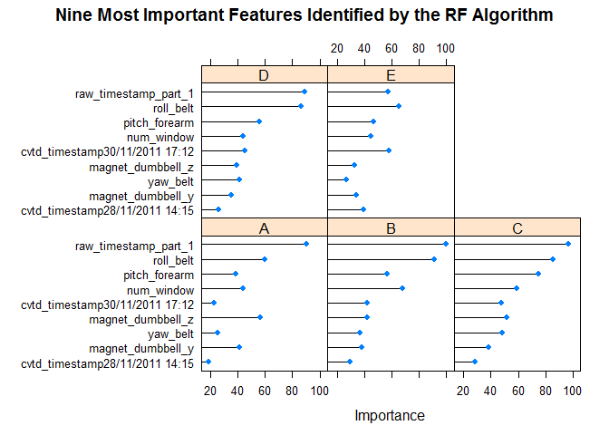

# Practical Machine Learning Project: Prediction Assignment Writeup
WZ  

### Synopsis
The aim of this work is to predict the quality of weight lifting exercises, using data from accelerometers on the belt, forearm, arm, and dumbell of 6 participants. We will evalute the in sample and out sample errors of various predition models, and use the best modle to predict 20 different test cases.
The data for this project come from this [source](http://groupware.les.inf.puc-rio.br/har).

### Data Cleaning
A quick inspection of the train and test data sets identified many NA.  This is particular true for the test set, in which 100 of the 160 variables contained NA only.  While the train data set also contains lots of NA, there is 0 variable that is entirely NA.  We will remove the 100 variables with entirely NA  in the test set and only inlcluded the remaining variables in modle building, evaluation, and prediction. This is simply due to the fact that we can not use the variables with NA entirely for prediction. We also removed the first two variables that contained the participants identification. At the end, 57 variables were included in the initial phase of model building.
We had a large train data set.  I used 80% for model building and 20% for cross validation.


```r
knitr::opts_chunk$set(echo = F)
```


```
## Loading required package: caret
```

```
## Loading required package: lattice
```

```
## Loading required package: ggplot2
```

```
## Loading required package: rpart
```

```
## Loading required package: randomForest
```

```
## randomForest 4.6-12
```

```
## Type rfNews() to see new features/changes/bug fixes.
```

```
## 
## Attaching package: 'randomForest'
```

```
## The following object is masked from 'package:ggplot2':
## 
##     margin
```


```r
train <- read.csv("https://d396qusza40orc.cloudfront.net/predmachlearn/pml-training.csv")
test <- read.csv("https://d396qusza40orc.cloudfront.net/predmachlearn/pml-testing.csv")

ncol(test[ , ! apply( test, 2 , function(x) all(is.na(x)) ) ])
```

```
## [1] 60
```

```r
ncol(train[ , ! apply( train, 2 , function(x) all(is.na(x)) ) ])
```

```
## [1] 160
```

```r
test1 <- test[ , ! apply( test, 2 , function(x) all(is.na(x)) ) ]
test1 <- test1[,3:60]
train1 <- train[,names(train) %in% names(test1)]
train1$classe <- train$classe
names(train1)
```

```
##  [1] "raw_timestamp_part_1" "raw_timestamp_part_2" "cvtd_timestamp"      
##  [4] "new_window"           "num_window"           "roll_belt"           
##  [7] "pitch_belt"           "yaw_belt"             "total_accel_belt"    
## [10] "gyros_belt_x"         "gyros_belt_y"         "gyros_belt_z"        
## [13] "accel_belt_x"         "accel_belt_y"         "accel_belt_z"        
## [16] "magnet_belt_x"        "magnet_belt_y"        "magnet_belt_z"       
## [19] "roll_arm"             "pitch_arm"            "yaw_arm"             
## [22] "total_accel_arm"      "gyros_arm_x"          "gyros_arm_y"         
## [25] "gyros_arm_z"          "accel_arm_x"          "accel_arm_y"         
## [28] "accel_arm_z"          "magnet_arm_x"         "magnet_arm_y"        
## [31] "magnet_arm_z"         "roll_dumbbell"        "pitch_dumbbell"      
## [34] "yaw_dumbbell"         "total_accel_dumbbell" "gyros_dumbbell_x"    
## [37] "gyros_dumbbell_y"     "gyros_dumbbell_z"     "accel_dumbbell_x"    
## [40] "accel_dumbbell_y"     "accel_dumbbell_z"     "magnet_dumbbell_x"   
## [43] "magnet_dumbbell_y"    "magnet_dumbbell_z"    "roll_forearm"        
## [46] "pitch_forearm"        "yaw_forearm"          "total_accel_forearm" 
## [49] "gyros_forearm_x"      "gyros_forearm_y"      "gyros_forearm_z"     
## [52] "accel_forearm_x"      "accel_forearm_y"      "accel_forearm_z"     
## [55] "magnet_forearm_x"     "magnet_forearm_y"     "magnet_forearm_z"    
## [58] "classe"
```

```r
set.seed(128)
training_i <- createDataPartition(y=train1$classe, p=0.8, list=F)
training <- train1[training_i,]
cv <- train1[-training_i,]
dim(test1)
```

```
## [1] 20 58
```

```r
dim(training)
```

```
## [1] 15699    58
```

```r
dim(cv)
```

```
## [1] 3923   58
```
### Model Building
I evaluated the perpormance of the following two algorithms. 


1. Decision trees with CART (rpart).
2. Random forest decision trees (randomForest).

Package rpart was used here since it appeared to be much faster that the corresponding caret package method. The 'rf' train method of the caret package was used since I had difficulties using the randomForest package in predicting the test data. A three fold validation is used in the random forest model.


```r
m_cart <- rpart(classe ~ ., method='class', data = training)
printcp(m_cart)
```

```
## 
## Classification tree:
## rpart(formula = classe ~ ., data = training, method = "class")
## 
## Variables actually used in tree construction:
##  [1] accel_dumbbell_y     accel_forearm_x      cvtd_timestamp      
##  [4] magnet_belt_y        magnet_dumbbell_x    magnet_dumbbell_z   
##  [7] num_window           pitch_belt           raw_timestamp_part_1
## [10] roll_belt            roll_dumbbell       
## 
## Root node error: 11235/15699 = 0.71565
## 
## n= 15699 
## 
##          CP nsplit rel error  xerror      xstd
## 1  0.256876      0   1.00000 1.00000 0.0050308
## 2  0.101024      1   0.74312 0.74357 0.0055646
## 3  0.060525      2   0.64210 0.64530 0.0055598
## 4  0.053494      3   0.58158 0.59208 0.0055109
## 5  0.049755      5   0.47459 0.48999 0.0053216
## 6  0.049355      7   0.37508 0.42385 0.0051267
## 7  0.020472      9   0.27637 0.28349 0.0044848
## 8  0.018959     10   0.25590 0.25741 0.0043233
## 9  0.014953     11   0.23694 0.24183 0.0042190
## 10 0.012906     12   0.22198 0.22216 0.0040780
## 11 0.011704     13   0.20908 0.20730 0.0039641
## 12 0.010592     15   0.18567 0.18291 0.0037616
## 13 0.010000     16   0.17508 0.17846 0.0037223
```

```r
m_rf <- train(classe ~ ., 
              data = training,
              method='rf',
              trControl = trainControl(method = "cv", number = 3),
              importance=TRUE)

print(m_rf)
```

```
## Random Forest 
## 
## 15699 samples
##    57 predictor
##     5 classes: 'A', 'B', 'C', 'D', 'E' 
## 
## No pre-processing
## Resampling: Cross-Validated (3 fold) 
## Summary of sample sizes: 10465, 10467, 10466 
## Resampling results across tuning parameters:
## 
##   mtry  Accuracy   Kappa    
##    2    0.9920378  0.9899268
##   38    0.9992357  0.9990333
##   75    0.9980254  0.9975023
## 
## Accuracy was used to select the optimal model using  the largest value.
## The final value used for the model was mtry = 38.
```
### Out of Sample Errors
Out Of sample errors of the above three models were assessed using the predict function on the train data partitioned for cross validation.


```r
p_cart <- predict(m_cart, newdata = cv, type='class')
cm_cart <- table(cv$classe, p_cart)
a_cart <- sum(cm_cart[row(cm_cart) == col(cm_cart)])/sum(cm_cart)

p_rf <- predict(m_rf, newdata = cv)
cm_rf <- table(cv$classe, p_rf)
a_rf <- sum(diag(cm_rf))/sum(cm_rf)

output <- data.frame(Model = c('CART','Random Forest'),
                     Accuracy = c(round(a_cart,3), round(a_rf,3)),
                     Error = c(round(1-a_cart,3), round(1-a_rf,3))
)
output
```

```
##           Model Accuracy Error
## 1          CART    0.868 0.132
## 2 Random Forest    0.999 0.001
```
### Variabl Importance 
Top 9 most important features identified by the random forest models are shown in the figure below.


```r
plot(varImp(m_rf),top =9, main="Nine Most Important Features Identified by the RF Algorithm")
```

<!-- -->

###Prediction
I compared the prediction results of both the CART and random forest models using the test data set of 20 observations.


```r
test_cart <- predict(m_cart, newdata=test1,type='class')
test_rf <- predict(m_rf, newdata = test1)

TestPrediction <- data.frame(problem_id = test1$problem_id,
                             CART_pred = test_cart,
                             RF_pred = test_rf)

TestPrediction
```

```
##    problem_id CART_pred RF_pred
## 1           1         B       B
## 2           2         A       A
## 3           3         C       B
## 4           4         A       A
## 5           5         A       A
## 6           6         E       E
## 7           7         D       D
## 8           8         C       B
## 9           9         A       A
## 10         10         A       A
## 11         11         B       B
## 12         12         C       C
## 13         13         B       B
## 14         14         A       A
## 15         15         E       E
## 16         16         E       E
## 17         17         A       A
## 18         18         B       B
## 19         19         B       B
## 20         20         B       B
```

```r
sum(TestPrediction[,2] == TestPrediction[,3])
```

```
## [1] 18
```
###Conclusion
The random forest model outperformed the CART model in classification of the weight lift patterns, judging by the out of sample error rates.However, the computation is significant shorter for theCART algorithms in the rpart package. There is a 90% agreement between the CART and random forest prediction on the 20 test observation (18/20).


